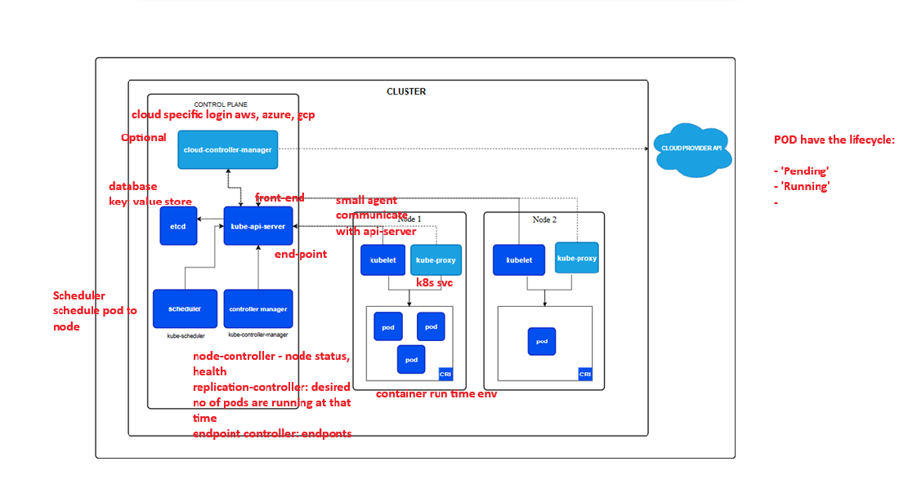

# 🛡️ AWS EKS Cluster Setup and Application Deployment Guide

## 📘 1. AWS Account Creation

1. Go to [https://aws.amazon.com/](https://aws.amazon.com/).
2. Click on **“Create an AWS Account”**.
3. Provide your email, password, and account name.
4. Complete contact, payment, and identity verification steps.
5. Once the account is ready, log in to the [AWS Management Console](https://console.aws.amazon.com/).

---

## 👤 2. Create an IAM User

1. Go to **IAM** in the AWS Console.
2. Navigate to **Users > Add Users**.
3. Enter a **User name** (e.g., `eks-admin`).
4. Select **Access key - Programmatic access**.
5. Click **Next: Permissions**.
6. Attach existing policies like:
    - `AdministratorAccess` (or scoped down as per needs)
7. Click through to **Create user** and download the credentials.

---

## 🔐 3. Generate Security Credentials

Upon user creation, you'll get:
- **Access Key ID**
- **Secret Access Key**

You’ll need these to configure the AWS CLI.

---

## 🧰 4. Install AWS CLI

Download and install the AWS CLI from:  
[https://aws.amazon.com/cli/](https://aws.amazon.com/cli/)

Verify installation:

```bash
aws --version
```

---

## 🧱 5. Install eksctl

### For Windows (manual steps):

1. Download from: https://github.com/eksctl-io/eksctl/releases/latest
2. Extract `eksctl.exe` to a folder (e.g., `C:\Program Files\eksctl`)
3. Add that folder to your system `PATH` environment variable.

Verify:

```bash
eksctl version
```

---

## 🛠️ 6. Install kubectl

Download `kubectl` from: https://kubernetes.io/docs/tasks/tools/

Verify:

```bash
kubectl version --client
```

---

## ⚙️ 7. Configure AWS CLI

Use the IAM credentials from earlier:

```bash
aws configure
```

Enter:
- Access Key ID
- Secret Access Key
- Default Region (e.g., `ap-south-2`)
- Output Format (e.g., `json`)

Verify configuration:

```bash
aws configure list
```

---

## ☸️ 8. Create EKS Cluster

Run the following command:

```bash
eksctl create cluster \
  --name my-cluster \
  --region ap-south-2 \
  --version 1.29 \
  --nodegroup-name linux-nodes \
  --node-type t3.medium \
  --nodes 2 \
  --managed \
  --with-oidc
```

This creates:
- EKS Control Plane
- Managed Node Group
- OIDC provider for IAM roles

---

## 🔗 9. Connect to the Cluster

Update your `kubeconfig` to interact with the cluster:

```bash
aws eks update-kubeconfig --region ap-south-2 --name my-cluster
```

Test connection:

```bash
kubectl get nodes
```

---

## 🚀 10. Deploy Applications

Run this command to deploy Kubernetes manifests:

```powershell
kubectl apply -f [C:\Users\vsrid\IdeaProjects\blue-green-jenkins-java-app\k8s\](https://github.com/savipavan/blue-green-jenkins-java-app/blob/main/k8s/deployment-blue.yaml)

```

---

## 🧾 11. View Kubernetes Configuration

### View current context:
```bash
kubectl config current-context
```

### View all contexts:
```bash
kubectl config get-contexts
```

### View entire kubeconfig file:
```bash
kubectl config view
```

---
## AWS Architecture discussion



https://kubernetes.io/docs/concepts/architecture/#kube-apiserver
---
## ☸️ 8. Delete EKS Cluster(Important to save billing)

Run the following command:

```bash
eksctl delete cluster --name my-cluster --region ap-south-2

```

This deletes:
- EKS Control Plane
- Managed Node Group
- OIDC provider for IAM roles
- EKS Cluster

---
## ✅ Done!

You have now:
- Created an AWS account and user
- Installed required tools
- Created and connected to an EKS cluster
- Deployed your application
